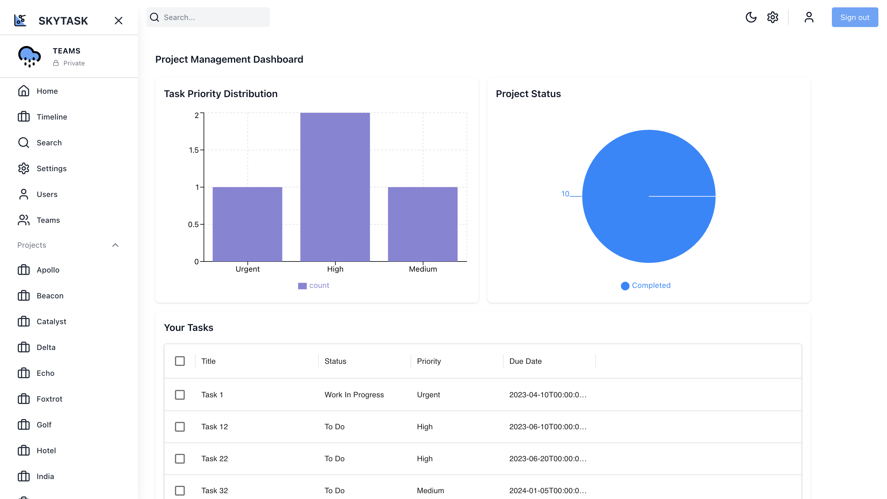
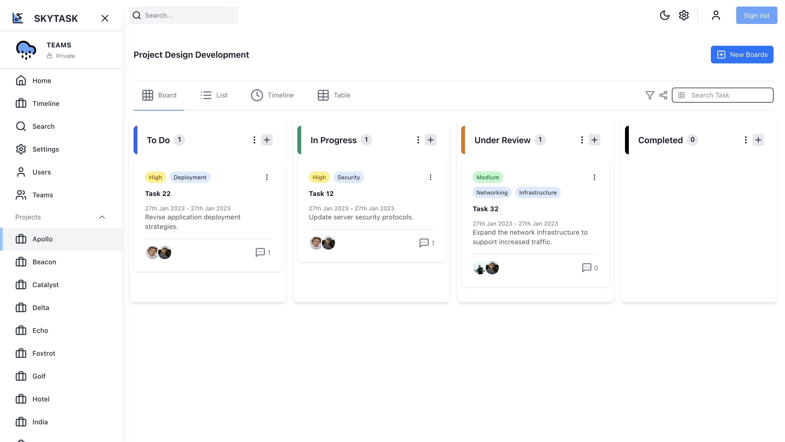
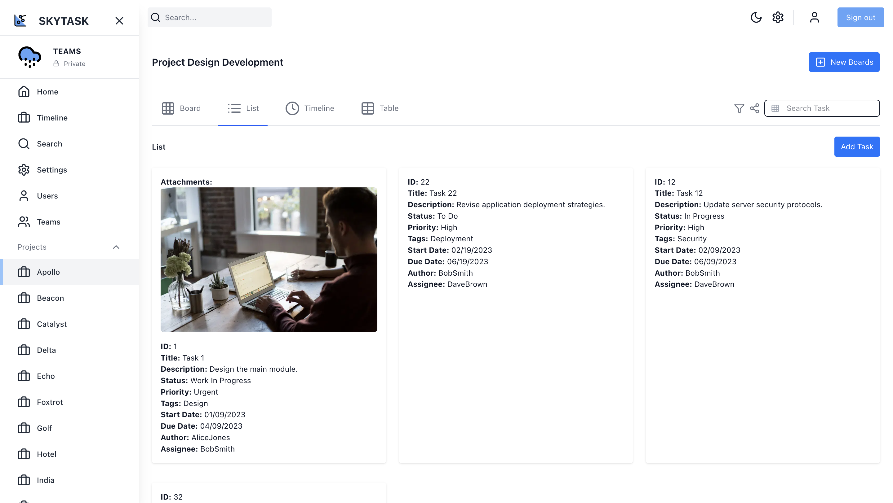
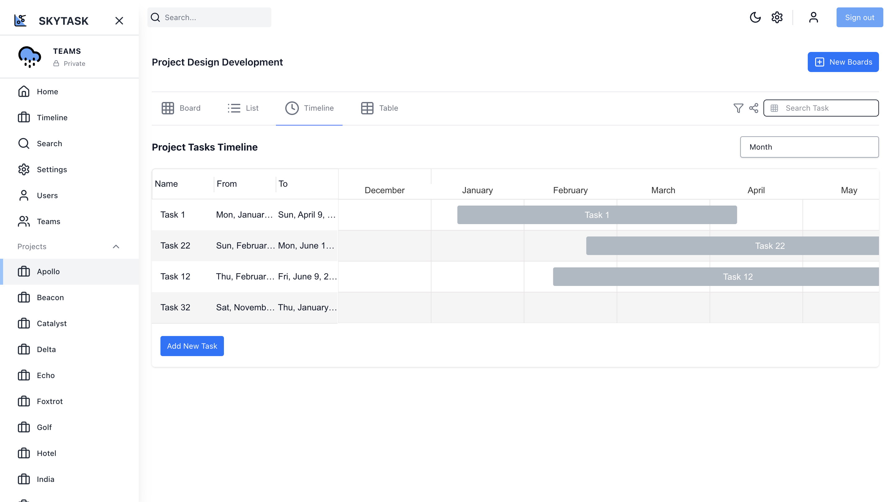
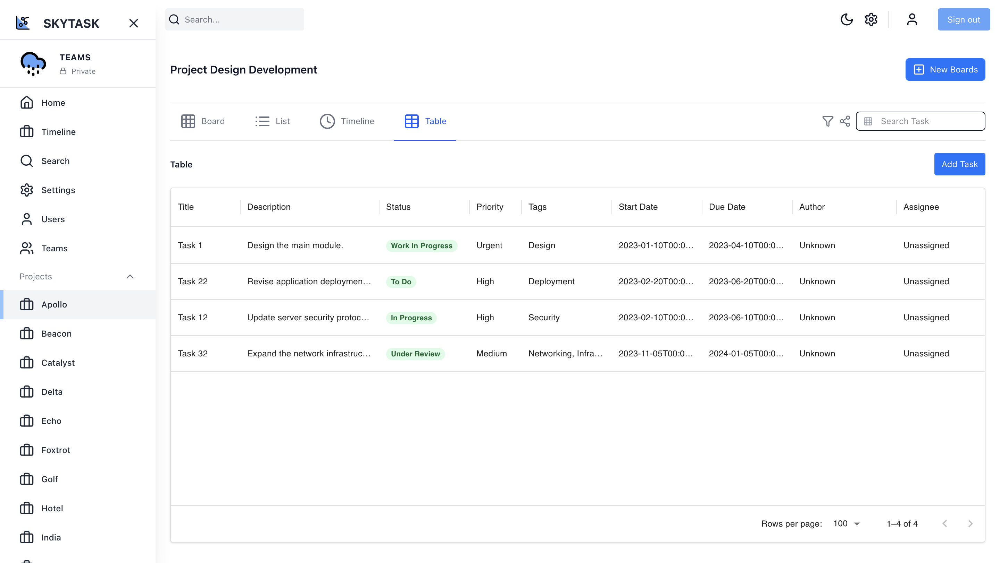
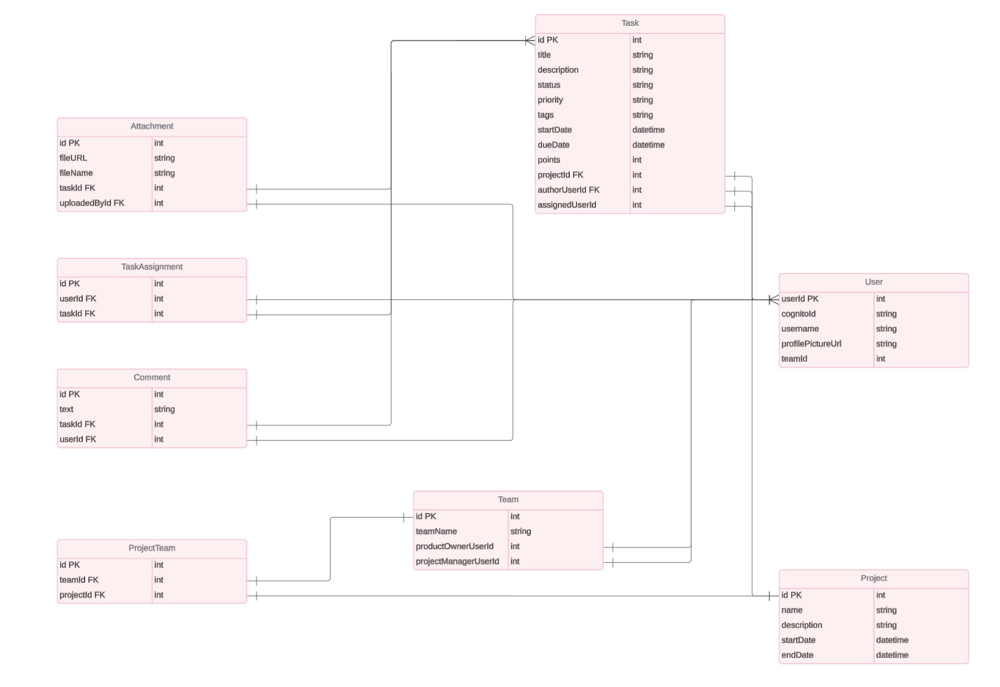
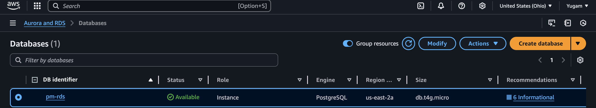
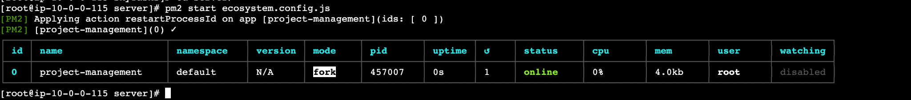
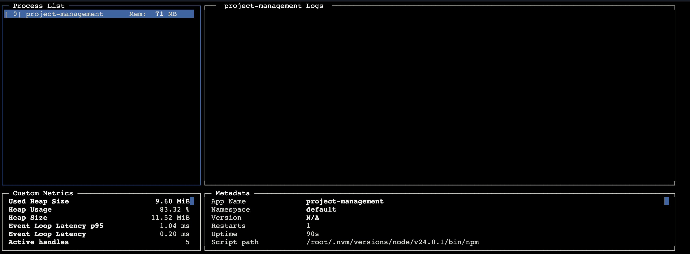
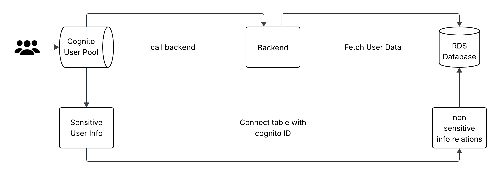

## SkyTask

> **SkyTask** is a cloud‑native project‑management dashboard—personally built and inspired by tools like Jira—fully hosted on AWS.

## Key Features

- **Multiple Work‑Views**

  - **Board (Kanban)** – drag tasks between columns with `react‑dnd`.
      

  - **List View** – List view with grid styling
     

  - **Timeline** – a Gantt‑style timeline view built with `gantt-task-react`.
     

  - **Table View** – Material UI Data Grid with sorting, filtering and inline editing.
     

- **Secure Authentication**

  - AWS Cognito user pools with email‑verification.
  - JWT‑based sessions; tokens validated on every API request.

- **Dark / Light Mode**

  - One‑click theme toggle. The selected mode is saved in local storage. Styles are implemented with Tailwind CSS and custom CSS variables.

- **Global Search**

  - Search bar returns matching tasks, projects, and users with sub‑second latency.

- **Data Export**

  - Exports the current view to CSV, retaining all active filters and sort settings.

- **Fully Responsive**
  - Layout adjusts seamlessly to mobile, tablet, and desktop widths using Tailwind breakpoints.

## Tech Stack

| Layer              | Main Tech                 | Version                                | Notes                                  |
| ------------------ | ------------------------- | -------------------------------------- | -------------------------------------- |
| **Frontend**       | Next.js                   | 15.2.3                                 | App directory, React 18                |
|                    | React                     | 18.x                                   |                                        |
|                    | Tailwind CSS              | 4.0                                    | JIT, plugin for prettier               |
|                    | Redux Toolkit / RTK Query | 2.6.1                                  | Global state + data fetching           |
|                    | Material UI (core)        | 6.4.8                                  | plus **X‑Data‑Grid** 7.28              |
|                    | Drag‑and‑drop             | `react‑dnd` 16.0.1                     | HTML5 backend                          |
|                    | Timeline                  | `gantt-task-react` 0.3.9               |                                        |
|                    | Charts                    | Recharts 2.15                          |                                        |
|                    | AWS Amplify (JS)          | 6.14.4                                 | connects to Cognito, API Gateway       |
| **Backend**        | Node.js                   | 20 LTS (tested)                        | Express 5                              |
|                    | Express                   | 5.1.0                                  | middleware: `cors`, `helmet`, `morgan` |
|                    | Prisma ORM                | 6.6.0                                  | Code‑first schema → PostgreSQL         |
|                    | PostgreSQL                | 15 (RDS)                               | managed via pgAdmin                    |
| **Infrastructure** | AWS EC2                   | Amazon Ubuntu 22 on t3.medium          | hosts Express API                      |
|                    | AWS RDS                   | Postgres 15 db.t3.micro                |                                        |
|                    | AWS S3                    | Static assets & CSV exports            |                                        |
|                    | AWS API Gateway           | REST endpoint in front of EC2 & Lambda |                                        |
|                    | AWS Lambda                | lightweight serverless tasks           |                                        |
|                    | Cognito                   | Authentication and Authorization       |                                        |
|                    | AWS Amplify Hosting       | CI/CD + front‑end deploy               |                                        |
| **Dev X**          | TypeScript                | 5.x (full‑stack)                       | strict mode                            |
|                    | ESLint + Prettier         | 9 / 3.x                                | Tailwind plugin                        |
|                    | Concurrency tooling       | `concurrently`, `nodemon`, `ts‑node`   |                                        |

## Database & Prisma Layer

The app uses **PostgreSQL 15** on AWS RDS, with Prisma ORM (code‑first).  
Below is the current ER diagram (generated from the Prisma schema).

### Entity‑relationship overview

### Core tables

| Table              | Key Columns                                                                                                                                          | Relationships                                                                                                                        |
| ------------------ | ---------------------------------------------------------------------------------------------------------------------------------------------------- | ------------------------------------------------------------------------------------------------------------------------------------ |
| **User**           | `userId` PK, `cognitoId`, `username`, `profilePictureUrl`, `teamId` FK                                                                               | • belongs to **Team**  • created/assigned tasks, comments                                                                         |
| **Team**           | `id` PK, `teamName`, `productOwnerUserId`, `projectManagerUserId`                                                                                    | • has many **Users**  • maps to projects via **ProjectTeam**                                                                      |
| **Project**        | `id` PK, `name`, `description`, `startDate`, `endDate`                                                                                               | • has many **Tasks**  • linked to teams via **ProjectTeam**                                                                       |
| **Task**           | `id` PK, `title`, `description`, `status`, `priority`, `tags`, `startDate`, `dueDate`, `points`, `projectId` FK, `authorUserId` FK, `assignedUserId` | • belongs to **Project**  • many‑to‑many with **User** through **TaskAssignment**  • has many **Comments** and **Attachments** |
| **TaskAssignment** | `(id, userId FK, taskId FK)`                                                                                                                         | joins **Task** ⇆ **User** (extra assignees)                                                                                          |
| **Comment**        | `id` PK, `text`, `taskId` FK, `userId` FK                                                                                                            | each comment belongs to a task and its author                                                                                        |
| **Attachment**     | `id` PK, `fileUrl`, `fileName`, `taskId` FK, `uploadedById` FK                                                                                       | files linked to tasks                                                                                                                |
| **ProjectTeam**    | `(id, teamId FK, projectId FK)`                                                                                                                      | joins **Project** ⇆ **Team** (many teams per project)                                                                                |

| Item               | Value             |
| ------------------ | ----------------- |
| **DB identifier**  | `pm‑rds`          |
| **Instance class** | `db.t4g.micro`    |
| **Region / AZ**    | us‑east‑2a (Ohio) |
| **Engine**         | PostgreSQL15      |
| **Primary ORM**    | Prisma 6.6        |

### Migrations & Seeding

- **Prisma Migrate** keeps schema in Git: `prisma/migrations/`.
- Seed script: `npm run seed` ➜ runs `prisma/seed.ts` to create demo users, a sample team, and mock tasks.

### Backend On EC2 With PM2

| Layer         | Technology                     | Version  | Notes                           |
| ------------- | ------------------------------ | -------- | ------------------------------- |
| Runtime       | Node.js                        | 20 LTS   | via NVM                         |
| Web framework | Express                        | 5.1.0    | REST API                        |
| Language      | TypeScript                     | 5.x      | strict mode                     |
| ORM           | Prisma                         | 6.6.0    | code‑first schema               |
| Database      | PostgreSQL                     | 15 (RDS) | instance `db.t4g.micro`         |
| Auth          | AWS Cognito                    | —        | JWT tokens verified per request |
| Utilities     | Helmet, CORS, Morgan           | —        | security, logging               |
| Dev Tooling   | ts‑node, Nodemon, Concurrently | —        | live reload                     |

### PM2: Process manager

#### Used PM2 to keep the Node.js API stable and easy to manage in production.

`pm2 start ecosystem.config.js` 

`pm2 monit`  

### Cognito Architecture

